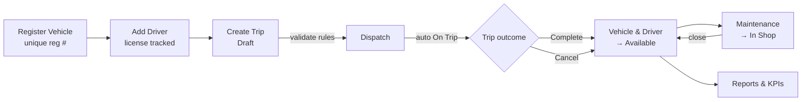
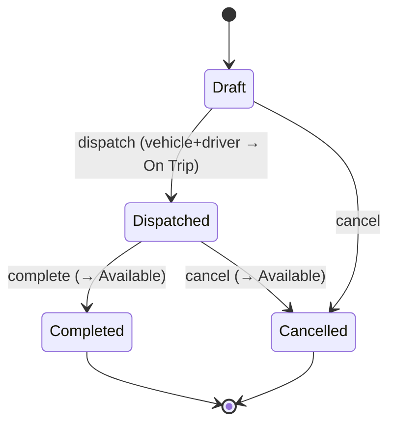
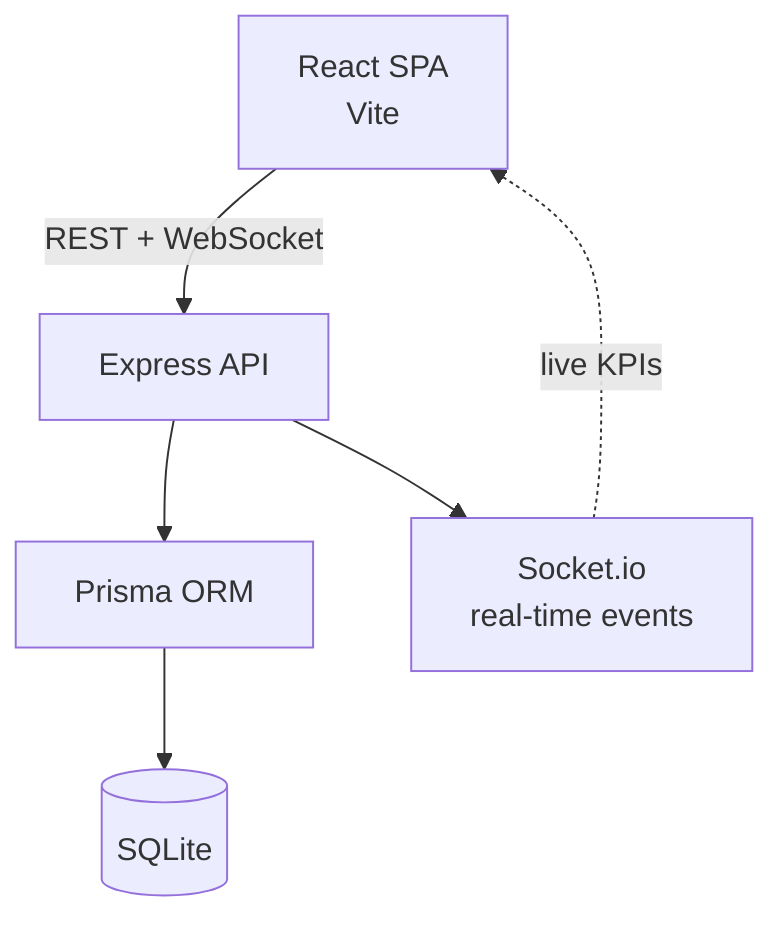

<div align="center">

# 🚚 TransitOps

### Smart Transport Operations Platform

**A role-based fleet & transport operations platform** that digitizes the full lifecycle —
vehicles, drivers, trips, dispatch, maintenance, and fuel/expenses — with **hard business rules**
that prevent bad dispatches and **auto-manage status** in real time.

> Logistics teams still run on spreadsheets and paper logbooks — causing scheduling conflicts,
> missed maintenance, expired-license dispatches, and untracked spend. **TransitOps replaces all of
> it with one enforced, real-time system** that makes bad operations impossible by design.

`React` · `Vite` · `Tailwind` · `shadcn/ui` · `Express` · `Prisma` · `SQLite` · `Socket.io`

</div>

---

## 📈 Project Status

<!-- STATUS:START -->
> **Last updated:** 2026-07-12 11:16  •  **Commits:** 19

**Recent activity**
- Merge pull request #8 from karm-tech/feat/drivers
- [FEAT]drivers:add driver profiles license compliance and safety-karm
- Merge pull request #7 from karm-tech/feat/users
- [FEAT]users:add admin user management profile page and login docs-karm
- Merge pull request #6 from karm-tech/feat/users
- [FEAT]users:add admin user management and profile page-karm
- Merge pull request #5 from karm-tech/feat/vehicles
- [FEAT]vehicles:add registry managed types admin role and demo banner-karm
<!-- STATUS:END -->

---

## 🔗 Demo & Login

> ### ⚡ Fastest way in
> On the login screen, click any **role button under "Open the demo"** to sign in instantly — no typing, sample data pre-loaded.

**Or sign in with credentials — every account uses the password `demo1234`:**

| Role | Email | Password |
|------|-------|----------|
| 🛡️ **Admin** — full access | **`admin@transitops.app`** | **`demo1234`** |
| Fleet Manager | `manager@transitops.app` | `demo1234` |
| Dispatcher | `dispatcher@transitops.app` | `demo1234` |
| Safety Officer | `safety@transitops.app` | `demo1234` |
| Financial Analyst | `finance@transitops.app` | `demo1234` |

> 🔑 **To administer the system, log in as Admin** (`admin@transitops.app` / `demo1234`), then open **Users** to create accounts and assign roles. Roles are assigned only by an Admin — there is no public sign-up.

---

## ✨ Features

- **Authentication & RBAC** — Email/password login, JWT sessions, and role-based access (Admin, Fleet Manager, Dispatcher, Safety Officer, Financial Analyst) with route guards. Admin has full access.
- **Dashboard** — Live KPIs (Active/Available Vehicles, In Maintenance, Active/Pending Trips, Drivers On Duty, Fleet Utilization %) with filters by vehicle type, status, and region.
- **Vehicle Registry** — Master list of vehicles with a **unique** registration number, load capacity, odometer, acquisition cost, and lifecycle status.
- **Driver Management** — Driver profiles with license number/category/expiry, safety score, and status — with compliance checks baked in.
- **Trip Management** — Full trip lifecycle (Draft → Dispatched → Completed → Cancelled) with a **Smart Dispatch Guard** that blocks invalid trips and explains exactly why.
- **Maintenance** — Log maintenance and the vehicle **auto-moves to In Shop** (hidden from dispatch); closing it restores availability.
- **Fuel & Expense** — Record fuel logs and expenses; **operational cost auto-computes** per vehicle.
- **Reports & Analytics** — Fuel efficiency, fleet utilization, operational cost, and Vehicle ROI, with **CSV and PDF export** and visual charts.
- **Vehicle Documents** — Attach and manage vehicle documents (RC, insurance, permit) per vehicle.
- **License Reminders** — Email reminders for drivers with expiring/expired licenses.
- **Real-time** — Live KPI/status updates across the app via Socket.io.
- **Polish** — Light theme by default with **dark mode** toggle, global search, filters and sorting, and a consistent, responsive UI.

## 🔄 How It Works

TransitOps follows the full transport lifecycle — each step enforces the next:

```
 Vehicle  ──▶  Driver  ──▶  Trip  ──▶  Dispatch  ──▶  Complete  ──▶  Maintenance  ──▶  Reports
 (register    (license      (validate   (auto On      (auto back     (auto In Shop)     (efficiency,
  unique)      tracked)      rules)      Trip)         to Available)                     ROI, cost)
```



### Trip State Machine



## 🛡️ Mandatory Business Rules

The heart of TransitOps — every rule is enforced **server-side** and surfaced clearly in the UI:

| # | Rule |
|---|------|
| R1 | Vehicle registration number must be **unique**. |
| R2 | **Retired** or **In Shop** vehicles never appear in the dispatch selection. |
| R3 | Drivers with an **expired license** or **Suspended** status cannot be assigned to trips. |
| R4 | A driver or vehicle already **On Trip** cannot be assigned to another trip. |
| R5 | **Cargo weight** must not exceed the vehicle's maximum load capacity. |
| R6 | **Dispatching** a trip auto-sets vehicle **and** driver to *On Trip*. |
| R7 | **Completing** a trip auto-restores both to *Available*. |
| R8 | **Cancelling** a dispatched trip restores both to *Available*. |
| R9 | Creating an active **maintenance** record auto-sets the vehicle to *In Shop*. |
| R10 | **Closing** maintenance restores the vehicle to *Available* (unless Retired). |

## 🧰 Tech Stack

| Layer | Technology |
|-------|-----------|
| Frontend | React, Vite, Tailwind CSS, shadcn/ui, React Router, TanStack Query, React Hook Form + Zod, Recharts |
| Backend | Node.js, Express, Prisma ORM, SQLite, Socket.io |
| Auth | JWT, bcrypt, role-based middleware (RBAC) |
| Documents & Reports | CSV + PDF export (@react-pdf/renderer), file uploads |
| Notifications | Nodemailer (license-expiry email reminders) |

## 🏗️ Architecture



The frontend is organized by feature module (one folder per domain); the backend exposes a REST API per resource with Zod validation and JWT/role guards. All status transitions are enforced on the server as the single source of truth.

## 🚀 Getting Started

Prerequisites: **Node.js >= 18** and **npm >= 9**. No database server needed (SQLite is bundled).

```bash
git clone https://github.com/karm-tech/transitops.git
cd transitops
npm install      # frontend dependencies
npm run setup    # installs API deps, creates the SQLite database, seeds demo data
npm run dev      # runs the API (:4000) and web app (:5173) together
```

Open **http://localhost:5173** — see [**Demo & Login**](#-demo--login) above for one-click demo access or the account credentials.

## 📁 Project Structure

```
transitops/
├── src/                      React frontend
│   ├── app/                  providers (auth, query, socket)
│   ├── components/           ui (shadcn), layout, common
│   ├── features/             one module per domain
│   │   ├── auth/ dashboard/ vehicles/ drivers/
│   │   └── trips/ maintenance/ finance/ reports/
│   ├── lib/                  api client, utils, realtime
├── server/                   Express + Prisma backend
│   ├── src/ routes/ middleware/ lib/
│   └── prisma/ schema.prisma  seed.js
└── docs/                     user guide & screenshots
```

## 📜 Scripts

| Command | Description |
|---------|-------------|
| `npm run dev` | Run backend API + frontend together |
| `npm run build` | Build the production bundle |
| `npm run preview` | Preview the production build |
| `npm run seed` | Reseed the local database with demo fleet data |

---

<div align="center"><i>TransitOps — Smart Transport Operations Platform</i></div>
